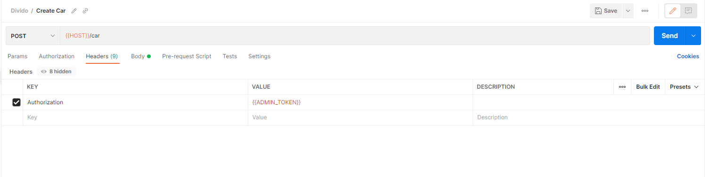
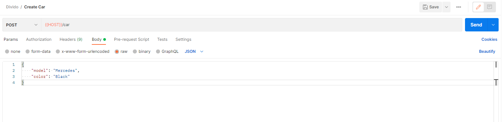
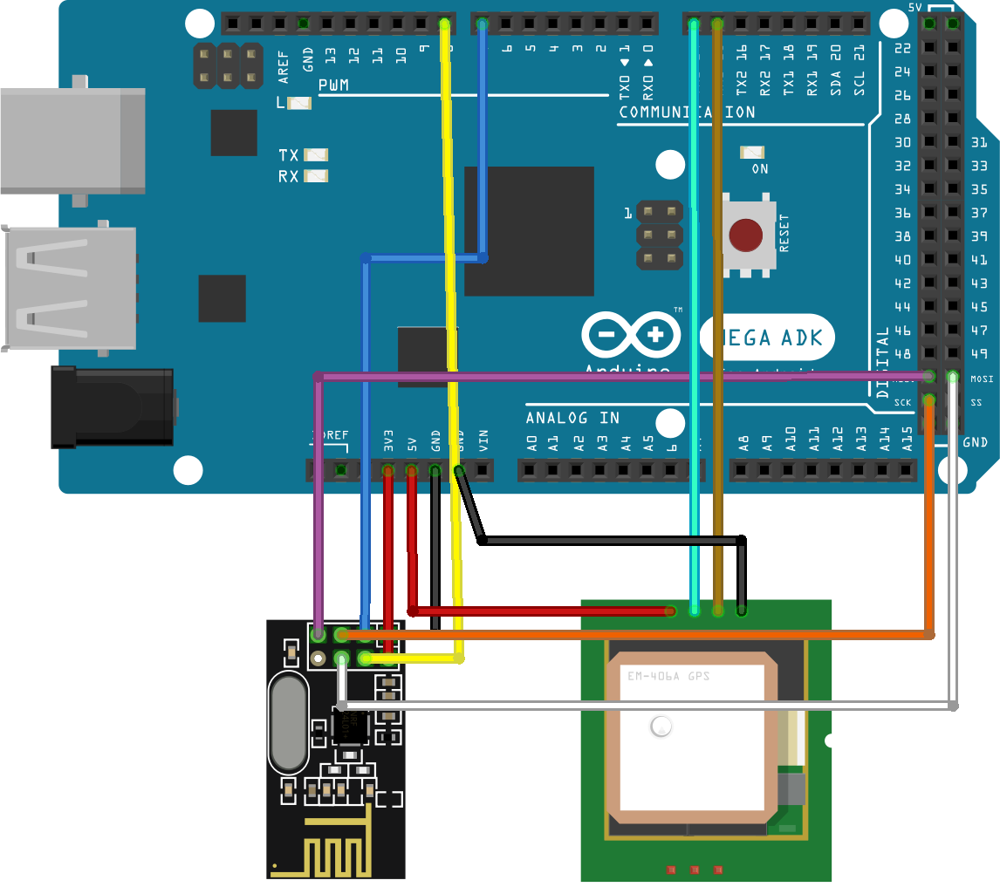
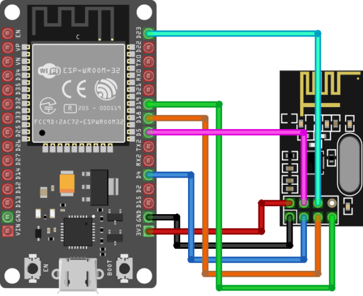

# Divido

## Getting Started

### Part 1: Setting up the Flask App
1. Go to the api directory of the project
    ```cmd
    cd api
    ```
2. Create a `.env` file for admin tokens as follows
    ```.env
    ADMIN_TOKEN=<admin-token>
    ```
3. Install dependencies
    ```cmd
    pip install -r ./requirements.txt
    ```
4. Run the app
    ```cmd
    python app.py
    ```
#### Postman
To interact with the API which has now been setup, we may use an HTTP Client like Postman. Following are the steps to add a new car to the database.
1. Create a new collection to group similar API requests
2. Add a new `POST` request to the collection for the creation of a new car object
3. Enter the URL location to which we wish to send our request. It will something like `localhost:<PORT>/car` in our case where we have the API server running locally.
4. Add a new header for authorization.

5. Add details of the car in the body of the request.

6. Send the request by clicking on the `Send` button in the top-right corner.


### Part 2: Setting up the React App
1. Go to the site directory of the project
    ```cmd
    cd site
    ```
2. Install dependencies
    ```cmd
    npm install
    ```
3. Run the app
    ```cmd
    npm start
    ```

### Part 3: Setting up the IoT devices
1. We need to have at least two devices, one for a car and one that acts like a server.
2. Wire up the devices as follows
<br>

<br>
This is for the car, the GPS Module is optional.
<br>

<br>
This is for the server.

3. Install the Arduino IDE and the ESP8266 board manager
4. Install the following libraries
    - RF24.h
    - TinyGPS++.h

5. In `espmain.ino`, change the following lines to match your network
    ```c
    const char* serverName = = "your-server-ip";
    const char* ssid = "your-ssid";
    const char* password = "your-password";
    ```
6. Upload the code in the `esp_main` directory to the server
7. Upload the code in the `gps_transmitter` directory to the car. This code is for the car with the GPS module.
8. Upload the code in the `static_transmitter` directory to the car. This code is for the car without the GPS module.
9. Power up the devices and wait for the server to connect to the network. You should see the following message on the serial monitor
    ```
    Connected to WiFi network with IP Address: your-esp-ip
    ```
10. You should be able to see the car's location on the map at `localhost:5000`
